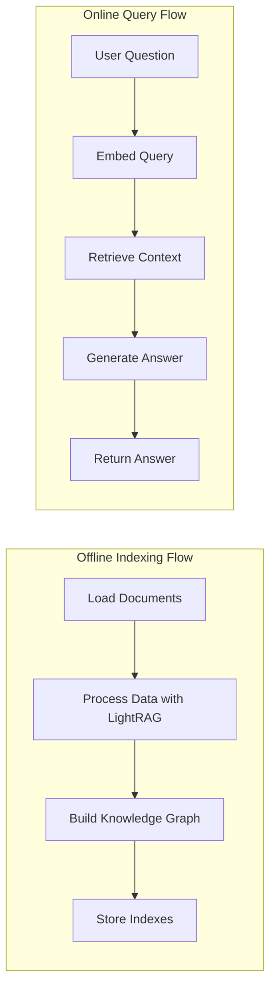

# LightRAG PDF Chatbot Design Document

## 1. Requirements

The user requires a chatbot that can read from a directory of PDFs and other document types, allowing users to ask questions about the content within them. We'll implement this using LightRAG, which supports a knowledge graph approach for enhanced retrieval capabilities.

### Primary Requirements:
- Load multiple document types (PDF, DOC, PPT, CSV) from a directory using LightRAG
- Process documents into a searchable index with a knowledge graph structure
- Allow users to ask questions about document content
- Return relevant and accurate answers with citations to the source documents
- Provide a user-friendly Streamlit interface for interaction

### User-Centric View:
- **Problem**: Users need to quickly find information across many documents without reading them all
- **Impact**: Save time, improve information retrieval efficiency, enable better decision-making

## 2. Flow Design

This project will implement LightRAG's "mixed" approach that includes both vector storage and a knowledge graph structure in Neo4j. This provides more comprehensive and contextual search capabilities.



### Workflow Steps:
1. **Offline Pipeline**: 
   - Scan directory for document files (PDF, DOC, PPT, CSV)
   - Process documents with LightRAG (which handles chunking and embeddings automatically)
   - Extract entities and relationships to build a knowledge graph
   - Store vector and graph data in respective storages

2. **Online Pipeline**:
   - Accept user question through Streamlit interface
   - Process and embed the question
   - Retrieve most relevant information from both vector storage and knowledge graph
   - Generate an answer using Gemini LLM with retrieved context
   - Return answer with citation to the source document

## 3. Utilities

We'll need several utility functions to interact with external systems:

1. **`load_documents.py`**
   - **Input**: Directory path
   - **Output**: List of document files
   - **Necessity**: Required to scan directories for document files
   - Example implementation:
   ```python
   # utils/load_documents.py
   import os
   
   def load_documents(directory_path):
       """Find all PDF, DOC, PPT, and CSV files in a directory."""
       supported_extensions = ['.pdf', '.doc', '.docx', '.ppt', '.pptx', '.csv']
       documents = []
       
       for root, _, files in os.walk(directory_path):
           for file in files:
               if any(file.lower().endswith(ext) for ext in supported_extensions):
                   documents.append(os.path.join(root, file))
       
       return documents
   
   if __name__ == "__main__":
       # Test the function
       docs_path = "./docs"
       found_docs = load_documents(docs_path)
       print(f"Found {len(found_docs)} documents: {found_docs}")
   ```

2. **`gemini_client.py`**
   - **Input**: Prompt with context
   - **Output**: LLM response
   - **Necessity**: Required for generating answers
   - Will use Google Gemini 2.0 Flash model
   - Example implementation:
   ```python
   # utils/gemini_client.py
   import os
   from openai import OpenAI
   
   def get_gemini_client():
       """Initialize and return a Gemini client using OpenAI compatibility."""
       api_key = os.environ.get("GEMINI_API_KEY")
       if not api_key:
           raise ValueError("GEMINI_API_KEY environment variable not set")
           
       client = OpenAI(
           api_key=api_key,
           base_url="https://generativelanguage.googleapis.com/v1beta/openai/"
       )
       return client
   
   def call_gemini(prompt, system_prompt=None):
       """Call the Gemini model with a prompt."""
       client = get_gemini_client()
       
       messages = []
       if system_prompt:
           messages.append({"role": "system", "content": system_prompt})
       
       messages.append({"role": "user", "content": prompt})
       
       response = client.chat.completions.create(
           model="gemini-2.0-flash",
           messages=messages
       )
       
       return response.choices[0].message.content
   
   if __name__ == "__main__":
       # Test the function
       print(call_gemini("Explain how AI works in one paragraph."))
   ```

3. **`neo4j_config.py`**
   - **Input**: Neo4j credentials
   - **Output**: Neo4j connection parameters
   - **Necessity**: Required for LightRAG to connect to Neo4j
   - Example implementation:
   ```python
   # utils/neo4j_config.py
   import os
   
   def get_neo4j_config():
       """Get Neo4j configuration from environment variables."""
       neo4j_uri = os.environ.get("NEO4J_URI", "bolt://localhost:7687")
       neo4j_username = os.environ.get("NEO4J_USERNAME", "neo4j")
       neo4j_password = os.environ.get("NEO4J_PASSWORD")
       
       if not neo4j_password:
           raise ValueError("NEO4J_PASSWORD environment variable must be set")
           
       return {
           "uri": neo4j_uri,
           "username": neo4j_username,
           "password": neo4j_password
       }
   
   if __name__ == "__main__":
       # Test the function
       try:
           config = get_neo4j_config()
           print("Neo4j configuration loaded successfully")
       except ValueError as e:
           print(f"Error: {e}")
   ```

## 4. System Architecture

### Key Components:

1. **LightRAG Setup**: 
   - Configure LightRAG to use Neo4j for graph storage
   - Set up embedding model to use "gemini-embedding-exp-03-07"
   - Configure LLM to use "gemini-2.0-flash"

2. **Neo4j Knowledge Graph**:
   - Store entities and relationships extracted from documents
   - Enable graph-based retrieval for context

3. **Streamlit Interface**:
   - Simple, intuitive UI for document upload and querying
   - Display of query results with source citations
   - Chat history management

### Shared Store Design:
```python
shared = {
    "config": {
        "docs_dir": "./docs",
        "working_dir": "./lightrag_data",
        "embedding_model": "gemini-embedding-exp-03-07",
        "llm_model": "gemini-2.0-flash"
    },
    "lightrag": None,  # Will hold the LightRAG instance
    "documents": [],   # Will hold paths to found documents
    "query": None,     # Will hold the user's question
    "answer": None     # Will hold the generated answer
}
```

## 5. Implementation Plan

### Phase 1: Environment Setup
1. Set up virtual environment and install dependencies
2. Configure Neo4j instance
3. Set up environment variables for API keys and credentials

### Phase 2: LightRAG Integration
1. Implement document loading functionality
2. Configure and initialize LightRAG with Neo4j storage
3. Test document processing and knowledge graph creation

### Phase 3: Query Processing
1. Implement query embedding and retrieval functions
2. Set up Gemini LLM integration
3. Test end-to-end query-answer flow

### Phase 4: Streamlit Interface
1. Design and implement basic UI components
2. Add document upload and processing functionality
3. Create chat interface with history management
4. Add answer display with source citations

### Phase 5: Testing and Optimization
1. Test with various document types and query patterns
2. Optimize retrieval parameters for accuracy
3. Improve UI responsiveness and user experience

## 6. Code Implementation

### LightRAG Setup and Initialization

```python
# lightrag_setup.py
import os
import asyncio
from lightrag import LightRAG
from lightrag.utils import EmbeddingFunc
from utils.gemini_client import call_gemini

async def setup_lightrag(working_dir):
    """Initialize and set up a LightRAG instance."""
    # Ensure working directory exists
    os.makedirs(working_dir, exist_ok=True)
    
    # Define embedding function for Gemini
    async def gemini_embed(texts):
        """Embed texts using Gemini embedding model."""
        # Implementation here using Gemini API
        pass
    
    # Initialize LightRAG
    rag = LightRAG(
        working_dir=working_dir,
        llm_model_func=call_gemini,
        graph_storage="Neo4JStorage",  # Use Neo4j for knowledge graph
        embedding_func=EmbeddingFunc(
            embedding_dim=3072,  # Gemini embedding has 3072 dimensions
            max_token_size=8192,  # Maximum token input for Gemini embedding
            func=gemini_embed
        )
    )
    
    # Initialize storages
    await rag.initialize_storages()
    
    return rag
```

### Streamlit Application

```python
# app.py
import os
import streamlit as st
import asyncio
from utils.load_documents import load_documents
from lightrag_setup import setup_lightrag

async def insert_documents(rag, doc_paths):
    """Insert documents into LightRAG."""
    for doc_path in doc_paths:
        with open(doc_path, "rb") as f:
            content = f.read()
            await rag.insert(content, source_id=doc_path)
    
    return len(doc_paths)

async def process_query(rag, query):
    """Process a query using LightRAG."""
    response = await rag.query(query)
    return response

def main():
    # Set up Streamlit page
    st.set_page_config(page_title="Document Chatbot", layout="wide")
    
    # Initialize session state
    if "lightrag" not in st.session_state:
        st.session_state.lightrag = None
    if "chat_history" not in st.session_state:
        st.session_state.chat_history = []
    
    # Set up UI
    st.title("Document Chatbot with LightRAG")
    
    # Sidebar for document upload and processing
    with st.sidebar:
        st.header("Document Processing")
        
        # Document upload
        uploaded_files = st.file_uploader(
            "Upload Documents", 
            accept_multiple_files=True,
            type=["pdf", "doc", "docx", "ppt", "pptx", "csv"]
        )
        
        # Process button
        if uploaded_files and st.button("Process Documents"):
            # Save uploaded files
            doc_paths = []
            for file in uploaded_files:
                file_path = os.path.join("./temp_docs", file.name)
                with open(file_path, "wb") as f:
                    f.write(file.getbuffer())
                doc_paths.append(file_path)
            
            # Initialize LightRAG
            with st.spinner("Setting up LightRAG..."):
                st.session_state.lightrag = asyncio.run(setup_lightrag("./lightrag_data"))
            
            # Process documents
            with st.spinner(f"Processing {len(doc_paths)} documents..."):
                num_processed = asyncio.run(insert_documents(st.session_state.lightrag, doc_paths))
                st.success(f"Processed {num_processed} documents successfully!")
    
    # Main area for chat interface
    st.header("Chat")
    
    # Display chat history
    for message in st.session_state.chat_history:
        with st.chat_message(message["role"]):
            st.write(message["content"])
    
    # Chat input
    if query := st.chat_input("Ask a question about your documents"):
        # Add user message to chat history
        st.session_state.chat_history.append({"role": "user", "content": query})
        
        # Display user message
        with st.chat_message("user"):
            st.write(query)
        
        # Generate response
        if st.session_state.lightrag:
            with st.chat_message("assistant"):
                with st.spinner("Thinking..."):
                    response = asyncio.run(process_query(st.session_state.lightrag, query))
                    st.write(response)
            
            # Add assistant message to chat history
            st.session_state.chat_history.append({"role": "assistant", "content": response})
        else:
            with st.chat_message("assistant"):
                st.write("Please upload and process documents first.")
                st.session_state.chat_history.append({"role": "assistant", "content": "Please upload and process documents first."})

if __name__ == "__main__":
    main()
```

## 7. Deployment

1. **Local Deployment**:
   - Run with `streamlit run app.py`
   - Access via browser at http://localhost:8501

2. **Server Deployment**:
   - Install necessary dependencies
   - Set up systemd service or Docker container
   - Configure reverse proxy with nginx or similar

3. **Environment Variables**:
   - `GEMINI_API_KEY`: API key for Google Gemini
   - `NEO4J_URI`: URI for Neo4j database connection
   - `NEO4J_USERNAME`: Username for Neo4j authentication
   - `NEO4J_PASSWORD`: Password for Neo4j authentication

## 8. Future Enhancements

1. **Improved Document Processing**:
   - Add progress tracking for large document sets
   - Implement batch processing for better performance

2. **Advanced Query Capabilities**:
   - Add filters for document types or sources
   - Support for multi-turn conversations with memory

3. **UI Improvements**:
   - Document preview functionality
   - Visualization of the knowledge graph
   - Highlighting of source text in original documents

4. **Performance Optimization**:
   - Implement caching for frequent queries
   - Optimize embedding and retrieval parameters

5. **Security Enhancements**:
   - User authentication
   - Document access controls
   - API rate limiting