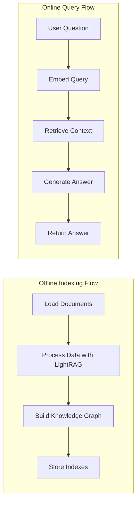

# Design Doc: LightRAG PDF Chatbot

> Please DON'T remove notes for AI

## Requirements

> Notes for AI: Keep it simple and clear.
> If the requirements are abstract, write concrete user stories

The LightRAG PDF Chatbot is designed to help users quickly find information across multiple document types without having to read them all.

### Primary Requirements:
- Load multiple document types (PDF, DOC, PPT, CSV) from a directory using LightRAG
- Process documents into a searchable index with a knowledge graph structure
- Allow users to ask questions about document content
- Return relevant and accurate answers with citations to the source documents
- Provide a user-friendly Streamlit interface for interaction

### User Stories:
- As a researcher, I want to quickly find specific information across multiple PDFs so I can save time on literature review
- As an analyst, I want to extract insights from various document formats without opening each file individually
- As a knowledge worker, I want accurate answers with source citations so I can verify the information

## Flow Design

> Notes for AI:
> 1. Consider the design patterns of agent, map-reduce, rag, and workflow. Apply them if they fit.
> 2. Present a concise, high-level description of the workflow.

### Applicable Design Pattern:

This project implements the RAG (Retrieval-Augmented Generation) design pattern, specifically using LightRAG's "mixed" approach that combines vector storage with a built-in knowledge graph structure for enhanced contextual search capabilities.

### Flow high-level Design:

1. **Offline Indexing Flow**: Processes documents into searchable indexes and knowledge graph
2. **Online Query Flow**: Handles user queries and retrieves relevant information to generate answers



## Utility Functions

> Notes for AI:
> 1. Understand the utility function definition thoroughly by reviewing the doc.
> 2. Include only the necessary utility functions, based on nodes in the flow.

1. **Load Documents** (`utils/load_documents.py`)
   - *Input*: Directory path (str)
   - *Output*: List of document file paths (List[str])
   - *Purpose*: Scans directories for supported document types (PDF, DOC, PPT, CSV)
   - Used by the Offline Indexing Flow to find documents for processing

2. **Gemini Client** (`utils/gemini_client.py`)
   - *Input*: Prompt with context (str)
   - *Output*: LLM response (str)
   - *Purpose*: Interfaces with Google Gemini 2.0 Flash model for answer generation
   - Used by the Online Query Flow to generate answers from retrieved context

3. **LightRAG Setup** (`utils/lightrag_setup.py`)
   - *Input*: Data path for storage (str)
   - *Output*: Initialized LightRAG instance
   - *Purpose*: Sets up and initializes LightRAG with proper configuration
   - Used by both flows to establish LightRAG with built-in knowledge graph persistence

## Node Design

### Shared Memory

> Notes for AI: Try to minimize data redundancy

The shared memory structure is organized as follows:

```python
shared = {
    "config": {
        "lightrag_data_path": "./lightrag_data",
        "temp_docs_path": "./temp_docs",
        "models": {
            "embedding": "gemini-embedding-exp-03-07",
            "llm": "gemini-2.0-flash"
        }
    },
    "documents": [],
    "rag_instance": None,
    "query": None,
    "retrieved_context": None,
    "answer": None,
    "source_citations": []
}
```

### Node Steps

> Notes for AI: Carefully decide whether to use Batch/Async Node/Flow.

1. **Load Documents Node**
  - *Purpose*: Scan directory for document files and populate the document list
  - *Type*: Regular
  - *Steps*:
    - *prep*: Read "config.temp_docs_path" from the shared store
    - *exec*: Call the load_documents utility function
    - *post*: Write "documents" list to the shared store

2. **Process Documents Node**
  - *Purpose*: Process documents with LightRAG and build knowledge graph
  - *Type*: Async (document processing can be time-consuming)
  - *Steps*:
    - *prep*: Read "documents" and "config" from shared store
    - *exec*: Initialize LightRAG and process each document
    - *post*: Write "rag_instance" to shared store

3. **Query Processing Node**
  - *Purpose*: Process user query and retrieve relevant context
  - *Type*: Regular
  - *Steps*:
    - *prep*: Read "query" and "rag_instance" from shared store
    - *exec*: Use LightRAG to retrieve context from vector and graph stores
    - *post*: Write "retrieved_context" to shared store

4. **Answer Generation Node**
  - *Purpose*: Generate answer using Gemini LLM with retrieved context
  - *Type*: Regular
  - *Steps*:
    - *prep*: Read "query", "retrieved_context" from shared store
    - *exec*: Call the gemini_client utility with query and context
    - *post*: Write "answer" and "source_citations" to shared store
